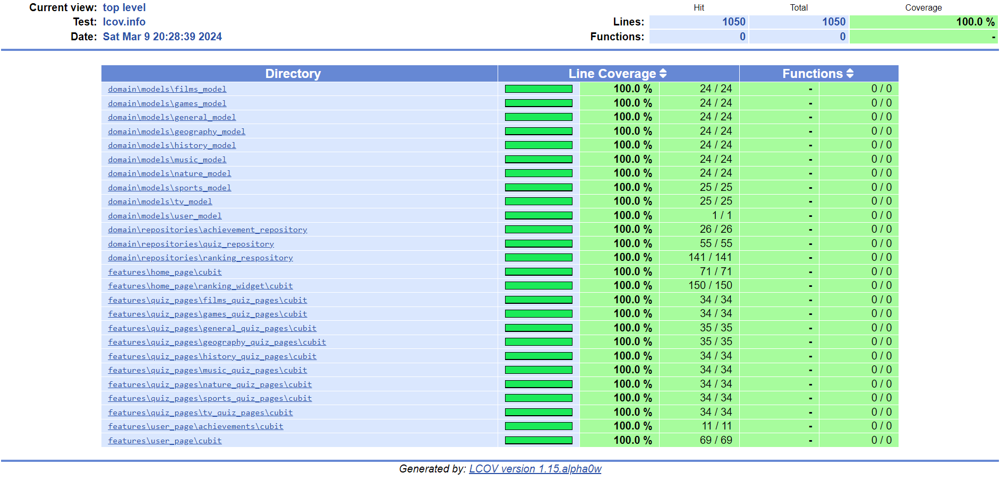

# QuizQuest

QuizQuest is an engaging application designed to put your knowledge to the test across various categories. Whether you are passionate about history, science, sports, or anything else, QuizQuest has something for everyone.

Track your progress and climb the ranks on the leaderboard. Discover fascinating facts and expand your knowledge base while earning achievements along the way. Share your accomplishments with others and revel in the joy of learning.

With QuizQuest, learning is not only educational but also entertaining. Dive into a world of trivia, challenge yourself, and embark on a journey of discovery.

## Test Coverage

## Demo Credentials

**Login** : test1@gmail.com

**Password** : Test123

## Features

- **Gaining category knowledge in Quizzes**: Choose a category and gain knowledge through quizzes and have fun!
  
- **Ranking**: Follow your score on the leaderboard!

- **Points scoring**: Score points and be better every single day!

- **Achievements**: Get achievements and stand out!

- **Personal Account**:  Create an account and add a photo to take full advantage of the app!
 
- **Share Button**: Share your result with others!

## Gif's

  
  
  
  
  

  
  
  
  
  
  

## You can download it here: 

https://play.google.com/store/apps/details?id=com.maciejsulikowski.quiz_quest

## Have fun with this app!
